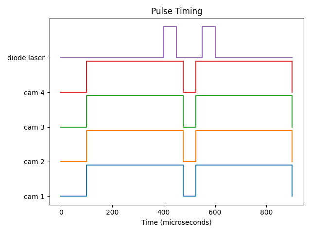

# OpenSync
An open source synchronizer for the velocimetry of fluids using a Raspberry Pi Pico 2 microcontroller.



# NOTICE
This is for a future project for an undergraduate course (that will be completed 2 semesters from now). The course is over embedded systems and programming design, and I'll think it will greatly enhance the code for the synchronizer. Currently, this repository is going to be left blank until I obtain a 2 or 4 channel >100MHz oscilloscope. Also, I decided to shift towards using a portion of the PrawnDO firmware (reference 3) for the serial interface due to performance and flexibility.

## The Plan
This idea was inspired by the use of an Arduino Uno to send TTL pulses to two Arducam ~1 MP monochrome global shutter cameras on one of my previouse experiments. However, that implementation used a simple loop that was hard-coded. To increase flexibility, a serial I/O interface should be created so that the user can change the parameters of the synchronizer while the device is on (not operating, though, as that could cause damage to lab equipment and maybe even the synchronizer itself). Due to the dynamic nature of the serial interface, optimization from hard-coding would be lost which could cause a loss in temporal resolution and accuracy. However, very efficient execution of instructions could be done using programmable input/output (PIO) on a RP2350-based microcontroller (e.g., Pico 2). The RP2350 could be used as an effective 8-channel arbitrary pulse generator with jitter as low as one clock cycle (10ns to 4ns). The dual-core nature of the RP2350 allows for one core to be dedicated to IO and another to the serial interface, thus alleviating the aforementioned issues with Arduino microcontrollers. The synchronizer is programmed using an 8 bit word (one bit for each channel) and a 32 bit word (delay to next instruction). The RP2350 supports a few thousand instructions, so great flexibility could be achieved. An external trigger (optional) could be used to execute the pulse sequence along with internal timing based on repitition in Hertz. The entire system can be 3D printed and soldered in-house in as little as an afternoon. This system would also allow for the use of up to 4 cameras in addition to a dual-head YAG/YLF laser.

## Design
OpenSync is a simple and low-cost synchronizer based on microcontroller technology. Due to the intrinsic nature of microcontrollers compared to more advanced devices (e.g., field programmable gate arrays), most complex features that are typical of commercial propietary devices such as gating, external trigger manipulation, etc are not implemented. However, OpenSync remains sufficiently flexible and provides enough support for most users' needs when performing a PIV experiment. This is because OpenSync is an arbitrary pulse generator under-the-hood which allows for rather complex pulse sequences to be synthesized through simple output port manipulation. Additionally, four (4) independent internal clocks can be utilized to allow for relatively advanced pulse timing. While this implementation for a synchronizer may be quite restrictive at times, it is what makes OpenSync so simple!

## Specs
 - **Main PLL Frequency**: overclocked to 200 MHz
 - **Output Channels**: 16
 - **Input Channel(s)**: 1
 - **Internal Synchronization Clocks**: 4
 - **I/O Channel Voltage**: 5V @ 50 Ohm
 - **I/O Resolution**: 1 clock cycle (5ns * clock divider)
 - **Min Pulse Width**: 5 clock cycles (25ns * clock divider)
 - **Max Pulse Width**: 2^32 - 1 cycles (~21.47s * clock divider)
 - **Ext. Trigger Min Pulse Width**: 5 clock cycles (25ns * clock divider)
 - **Ext. Trigger Jitter**: 2 clock cycles (10ns * clock divider)
 - **Max Pulse Sequence Length**: 32 pulses
 - **Pulse Sequence Repetition Jitter**: 2 clock cycles (10ns * clock divider)
 - **Pulse Sequence Repetition**: Up to 500,000 iterations
 - All powered via USB! (for now)


## File Architecture
```
opensync/
├── demos/                  # Demonstration images and videos
├── documents/              # OpenSync PDF manual (independent of device documentation)
├── firmware/               # Firmware for RP2350 microcontroller
│   ├── opensync/           # Source folder root directory
│   └──   ├── src/          # C and assembly source code files
│         └── external/     # PrawnDO TUSB interface code and liscense
├── hardware/               # Hardware for OpenSync
│   ├── opensync/           # Hardware folder root directory
│   └──   ├── Components/   # Parts necessary to build OpenSync
│         └── CAD/          # CAD files for 3D printing housing and parts
└── software/               # Python interfrace for OpenSync
    ├── opensync/           # Namespace package root directory
    └── docs/               # Sphinx documentation generator

```

## Documentation
Complete instructions to construct and use OpenSync are provided in [imaginary link to notebook-based rtd website].

## Quick Start

### Compilation
OpenSync uses the [RP2350](https://www.raspberrypi.com/products/rp2350/) microcontroller and [Pico SDK](https://www.raspberrypi.com/documentation/microcontrollers/c_sdk.html) as the basis for developing devices that require precise timing with great flexibility. However, there currently isn't an official IDE like the arduino IDE for this microcontroller. Instead, [Microsoft Visual Code](https://code.visualstudio.com/) with the [Pico SDK plugin](https://marketplace.visualstudio.com/items?itemName=raspberry-pi.raspberry-pi-pico) will be used as the IDE to compile the software. Compilation is extremely simple in this context as the IDE and CMake files take care of all the compilation steps. Simply open the root directory of the OpenSync source code with Microsoft Visual Code and click on `>>Compile<<` on the bottom right corner. This will generate the .uf2 file necessary for flashing firmware to the microcontroller.

### Flashing
Flashing firmware to OpenSync is extremely simple. Make sure OpenSync is disconnected from the computer. With the top cover off, press down on the white button on the Pico 2 development board and plug in OpenSync to a computer containing the .uf2 file generated during the compilation process. OpenSync will register itself as a storage device on most computers. Open the folder for OpenSync and drag the .uf2 file into the root directory. OpenSync should then disconnect and reconnect with the computer. During the first bootup, all status LEDs will turn on which indicated that the firmware has been successfully flashed.

### Self Test
Import the Python library `opensync` and type in the following command:
```python
from opensync.communication import device_comm_search, device_comm_open, device_comm_close
from opensync.system import device_system_test

# Find all open ports
ports = device_comm_search()
print(ports)

# Open serial connection with opensync device
sync_device = device_comm_open(port="Enter OpenSync USB port connection here")

# Test opensync device status and clocks frequencies
device_system_test(sync_device)

# Important! Close serial connection
device_comm_close(sync_device)
```
If successfull, no errors or warnings should be produced. Please note that all commands to and from opensync are terminated with CRLF. Additionally, all used output terminals should be validated on an osciliscope for peace-of-mind, allthough this is not strictly necessary.

## Context
https://groups.google.com/g/openpiv-users/c/xi7qt28IGEE

## Acknowledgments
Will be determined after the first milestone of this project.

## TODO
- [x] Add timing plot utilities
- [x] Add device containerization for customization
- [x] Add the ability to change channel names
- [ ] Add the ability to disable output channels (necessary?)
- [ ] Add four internal timers that can be mapped to pulse sequences
- [ ] Add the ability to count and skip external triggers (usefull for phase-locked stuff like rotor blades)
- [ ] Add second external trigger and output port masking
- [ ] Add POST bootup validation (not really necessary, but why not)
- [ ] Add video examples on YouTube
- [ ] Learn power electronics (this semester)
- [ ] Validate against an osciliscope

## References
 1. Stasicki, B. and Ehrenfried, K. and Dieterle, L. and Ludwikowski, K. and Raffel, M.  (2001) Advanced syncronization techniques for complex flow field investigations by means of PIV .    4th Intern. Symposium on Particle Image Velocimetry, Göttingen, Germany, September 17-19, 2001..     
 2. Radim Hošák, & Miroslav Ježek. (2018). Arbitrary digital pulse sequence generator with delay-loop timing. Review of Scientific Instruments, 89(4). https://doi.org/10.1063/1.5019685
 3. Scallon, A. (2017, June 18). Arduino TTL Pulse Generator and Controller. Optogenetics and Neural Engineering Core. https://optogeneticsandneuralengineeringcore.gitlab.io/ONECoreSite/projects/Arduino%20TTL%20Pulse%20Generator%20and%20Controller/
 4. Starkey, P. T., Turnbaugh, C., Miller, P., LeBlanc, K.-J., & Meyer, D. H. (2024). Experimental timing and control using microcontrollers. Review of Scientific Instruments, 95(10). https://doi.org/10.1063/5.0225550
    


