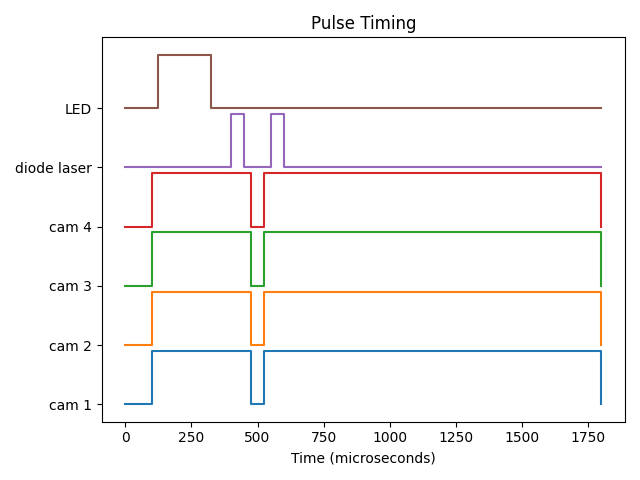

# OpenSync
An open source synchronizer for the velocimetry of fluids using a Raspberry Pi microcontroller.



## Purpose
OpenSync is a simple and low-cost synchronizer based on microcontroller technology. Due to the intrinsic nature of microcontrollers compared to more advanced devices (e.g., field programmable gate arrays), most complex features that are typical of commercial propietary devices such as gating, external trigger manipulation, etc are not implemented. However, OpenSync remains sufficiently flexible and provides enough support for most users' needs when performing a PIV experiment. This is because OpenSync is an arbitrary pulse generator under-the-hood which allows for rather complex pulse sequences to be synthesized through simple output port manipulation. Additionally, three (3) independent internal clocks can be utilized to allow for relatively advanced pulse timing. While this implementation for a synchronizer may be quite restrictive at times, it is what makes OpenSync so simple!

## Basic Specs
 - **System Frequency**: 250 MHz (4 ns resolution)
 - **Output Channels**: 8
 - **Input Channels**: 1
 - **I/O Channel Voltage**: 5V @ 50 Ohm
 - **I/O Resolution**: 1 clock cycle (4 ns * clock divider)
 - **Max Pulse Sequence Length**: 32 instruction pairs

For a more detailed specification, please read the [datasheet](documents/datasheet/opensync_datasheet_markdown.md).

## Advanced Features
 - Three (3) independent clocks mapped to all 8 output channels
 - Variable timing for each internal clock
 - Each clock can skip certain number of external triggers
 - Each clock can add delay between external trigger signal and pulse sequence signal 

## File Architecture
```
opensync/
├── demos/                  # Demonstration images and videos
├── documents/              # OpenSync development documentation
│   ├── manual/             # PDF manual (independent of device documentation) 
│   └── SDLC/               # System Development Life Cycle documentation
├── firmware/               # Firmware for RP2350 microcontroller
│   ├── opensync/           # Source folder root directory
│   └──   ├── src/          # C and assembly source code files
│         └── external/     # PrawnDO TUSB interface code and liscense
├── hardware/               # Hardware for OpenSync
│   ├── opensync/           # Hardware folder root directory
│   └──   ├── Components/   # Parts necessary to build OpenSync
│         └── CAD/          # CAD files for 3D printing housing and parts
└── software/               # Python interface for OpenSync
    ├── opensync/           # Namespace package root directory
    └── docs/               # Sphinx documentation generator

```

## Documentation
Complete instructions to construct and use OpenSync are provided in [imaginary link to notebook-based rtd website].

## Quick Start

### Compilation
OpenSync uses the [RP2350](https://www.raspberrypi.com/products/rp2350/) microcontroller and [Pico SDK](https://www.raspberrypi.com/documentation/microcontrollers/c_sdk.html) as the basis for developing devices that require precise timing with great flexibility. However, there currently isn't an official IDE like the arduino IDE for this microcontroller. Instead, [Microsoft Visual Code](https://code.visualstudio.com/) with the [Pico SDK plugin](https://marketplace.visualstudio.com/items?itemName=raspberry-pi.raspberry-pi-pico) will be used as the IDE to compile the software. Compilation is extremely simple in this context as the IDE and CMake files take care of all the compilation steps. Simply open the root directory of the OpenSync source code with Microsoft Visual Code and click on `>>Compile<<` on the bottom right corner. This will generate the .uf2 file necessary for flashing firmware to the microcontroller.

### Flashing
Flashing firmware to OpenSync is extremely simple. Make sure OpenSync is disconnected from the computer. With the top cover off, press down on the white button on the Pico 2 development board and plug in OpenSync to a computer containing the .uf2 file generated during the compilation process. OpenSync will register itself as a storage device on most computers. Open the folder for OpenSync and drag the .uf2 file into the root directory. OpenSync should then disconnect and reconnect with the computer. During the first bootup, all status LEDs will turn on which indicated that the firmware has been successfully flashed.

### Self Test
Import the Python library `opensync` and type in the following command:
```python
from opensync.communication import device_comm_search, device_comm_open, device_comm_close
from opensync.system import device_system_test

# Find all open ports
ports = device_comm_search()
print(ports)

# Open serial connection with opensync device
sync_device = device_comm_open(port="Enter OpenSync USB port connection here")

# Test opensync device status and clocks frequencies
device_system_test(sync_device)

# Important! Close serial connection
device_comm_close(sync_device)
```
If successfull, no errors or warnings should be produced. Please note that all commands to and from opensync are terminated with CRLF. Additionally, all used output terminals should be validated on an osciliscope for peace-of-mind, allthough this is not strictly necessary.


## Known Erratas
 - Pulsing at frequencies >1MHz could incur cross-talk and other noise between output channels (PCB design yet to be validated).

## Context
https://groups.google.com/g/openpiv-users/c/xi7qt28IGEE

## Acknowledgments
Will be determined after the first milestone of this project.

## TODO
- [x] Add timing plot utilities
- [x] Add device containerization for customization
- [x] Add the ability to change channel names
- [x] Add the ability to disable output channels (necessary?)
- [x] Add three internal timers that can be mapped to pulse sequences
- [x] Add the ability to count and skip external triggers (usefull for phase-locked stuff like rotor blades)
- [x] Add second external trigger and output port masking
- [ ] Use ICs for sub-ns jitter compensation
- [ ] Add POST bootup validation (not really necessary, but why not)
- [ ] Add video examples on YouTube
- [ ] Learn power electronics (this semester)
- [ ] Validate against an osciliscope

## References
 1. Radim Hošák, & Miroslav Ježek. (2018). Arbitrary digital pulse sequence generator with delay-loop timing. Review of Scientific Instruments, 89(4). https://doi.org/10.1063/1.5019685
 2. Scallon, A. (2017, June 18). Arduino TTL Pulse Generator and Controller. Optogenetics and Neural Engineering Core. https://optogeneticsandneuralengineeringcore.gitlab.io/ONECoreSite/projects/Arduino%20TTL%20Pulse%20Generator%20and%20Controller/
 3. Starkey, P. T., Turnbaugh, C., Miller, P., LeBlanc, K.-J., & Meyer, D. H. (2024). Experimental timing and control using microcontrollers. Review of Scientific Instruments, 95(10). https://doi.org/10.1063/5.0225550
 4. Stasicki, B. and Ehrenfried, K. and Dieterle, L. and Ludwikowski, K. and Raffel, M.  (2001) Advanced syncronization techniques for complex flow field investigations by means of PIV .    4th Intern. Symposium on Particle Image Velocimetry, Göttingen, Germany, September 17-19, 2001.  
    
## Licensing
- Software: All firmware and software components are covered by the GNU GPLv3 license.
- Hardware: All hardware is covered by the CERN-OHL-S-v2 license.