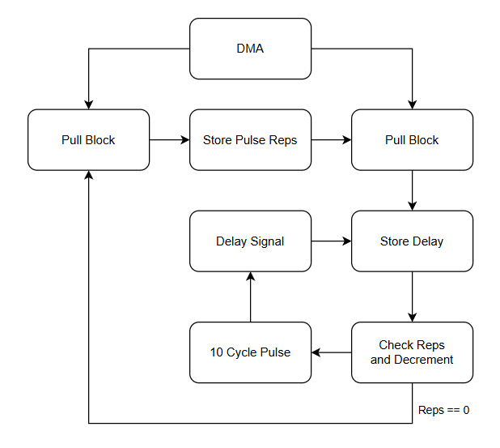
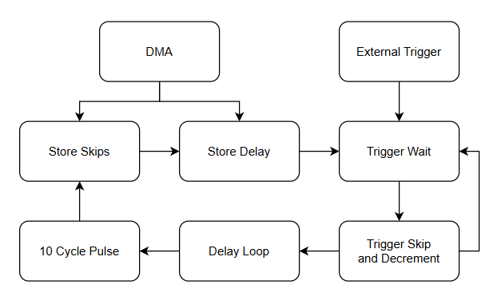
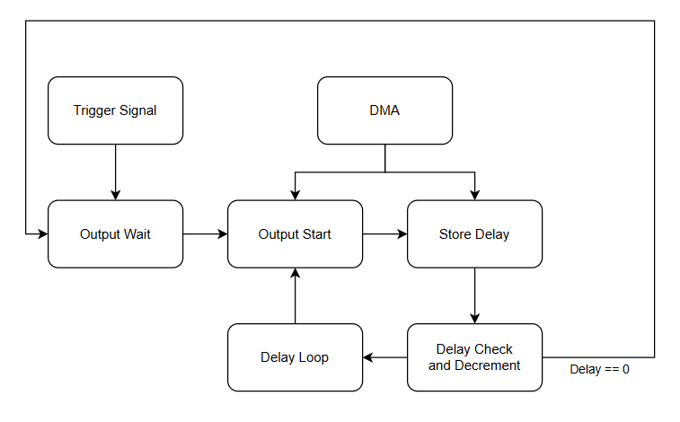

# On the design and implementation of a Synchronizer Timing Firmware

## Version History
| Date | Version | Change | 
| --- | --- | --- |
| 9/11/2025 | 0.1.0 | Intitial publishment. |

## Key Words
- DMA - Direct Memory Access
- FIFO - First in, First out
- FPGA - Field Programmable Gate Array
- ISR - Input Shift Register
- OSR - Output Shift Register
- PIO - Programmable Input/Output

## 1. Introduction
Synchronizing devices often require stringent and careful consideration when designing in order to promote precise and accurate timing. These considerations may include high system clock frequencies to increase resolution, firmware optimized for high throughput, among others. Issues related to timing are further excasterbated on microcontroller architecture, which OpenSync is designed for, since the timing resolution cannot be below one clock cycle unlike other hardware solutions (e.g., FPGAs). As such, it would be advantageous to better understand the necessary requirements in order to effectively implement firmware to transform microcontrollers into capable synchronizer devices.

At the heart of OpenSync relies the RP2354b microcontroller engineered by the Raspberry Pi Foundation. The RP2354b microcontroller is an 80 pin QFN microcontroller chip that houses numerous defining characteristics that makes it stand out against other microcontrollers in today's market. The most obvious advantage is the inclusion of three programmable input/ouput (PIO) blocks that each house four state machines. PIO blocks effectlvely act as a mini CPU that acts somewhat indepentently from the main CPU. This is particularly important since this allows for firmware programs loaded into state machines to run independently from main processes without blocking/stalling. This is effectively a microcontroller equivalent to concurrency which is often used to increase performance on critical code in numerous infrastructures. By utilizing state machines in an efficient manner, complex timing systems can be readily idealized on microcontroller architecture which may otherwise require peripheral components or FPGAs. 

Another advantage that the RP2354b microcontrollers have against their peers is its dual-core nature. Dual-core microcontrollers allow for further specialization of processes that exist simutaneously and harmoneously. In the case for OpenSync, a dual-core optmized system would be able to handle both serial commands and pulse sequencing without unwarranted conflicts. Such features makes the RP2354b microcontroller a suitable platform to utilize for the OpenSync project.

## 2. Primary Design
OpenSync's sequencer heavily utilizes PIO blocks and state machines to accomplish its goal of producing very reliable pulse timing characteristics. The basic design principle is quite simple: one PIO block focus on generating internal clock signals and another PIO block focuses on pulse timing and output. Each PIO block can hold up to 32 instructions of which the available instruction are listed below. Please note that these instructions are written in a subset of assembly calles pioasm (PIO assembly).

Table 1. PIO Assembly Instructions
| Instruction | Use |
| --- | --- |
| in | Read from ISR |
| out | Output from OSR |
| set | Directly write value to destination |
| mov | Copy data between source and destination |
| jmp | Conditional jump to label |
| push | Push to reciever of FIFO |
| pull | Pull from transciever of FIFO |
| wait | Conditional stall |

It should be mentioned that each instruction takes exactly one clock cycle to execute unless the state machine is stalled. This allows for simple and exact timing information to be imparted into a state machine through PIO assembly directives and DMA buffers.

## 3. Primary Implementation

## 3.1 PIO Block 1

Figure 1. Timing Diagram for Freerun Clock Signal Generator

Figure 2. Timing Diagram for Triggered Clock Signal Generator

## 3.2 PIO Block 2
Figure 3. Timing Diagram for Pulse Sequencer
