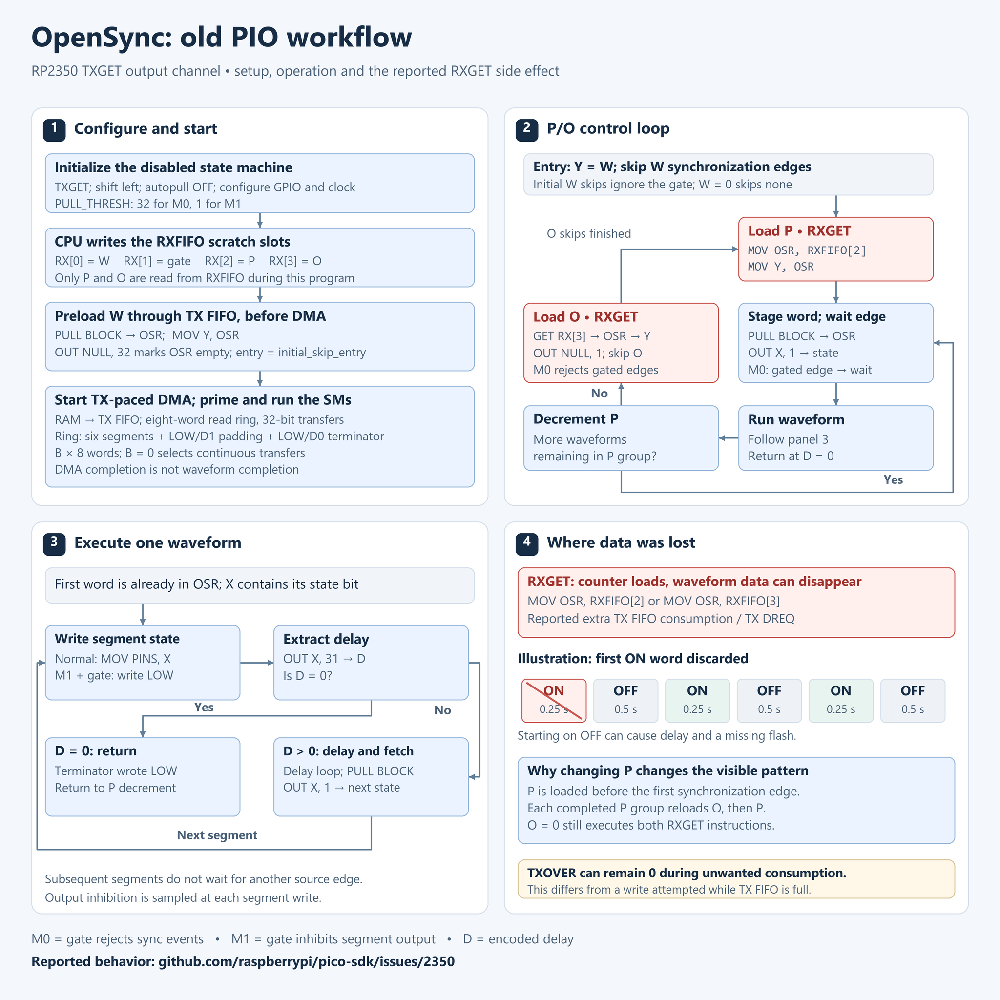

# Development Issues for the OpenSync Firmware

## Version History
| Date | Version | Change | 
| --- | --- | --- |
| 09/20/2026 | 0.1.0 | Intitial publishment. |

## Key Words
- DMA - Direct Memory Access
- FIFO - First in, First out
- RXFIFO - Receive First In, First Out
- TXFIFO - Transmit First In, First Out
- ISR - Input Shift Register
- OSR - Output Shift Register
- PIO - Programmable Input/Output
- GPIO - General Purpose Input/Output
- Word - A 32 bit variable in assembly language

## 1. Introduction
An updated version of the OpenSync synchronizer inspired from commercial digital delay/pulse generators is currently under development. This new revision places a focus on truely independent and programmable output channels using microcontroller technology. Each output channel consists of four counters (wait counter, burst counter, pulse counter, off counter) and an instruction buffer. Additionally, a gate selector allows for each channel to be configured for pulse or output inhibit. This effectively allowed for a wide variety of pulse sequences to be programmed. For instance, a wait counter allows for a select number of events to be ignored before starting pulse sequences. Burst counters work in the opposite way by limiting the number of pulses a channel may perform before it is disabled. Finally, pulse and off counters allow for instruction buffers to be executed in a determinate pattern based on internal or external events.

The core implementation details of the programs have been detailed a few times already in the previous sections, so beyond the brief overview given above, the overall design would not be repreated. However, the design of the PIO programs and state machine configuration functions would be discussed in short. The basic idea is a PIO program that consumes a ring buffer that hold the pulse sequencer's instructions. In addition to the ring buffer, there are RXFIFO memory slots used to store the counters and gate selection. The RXFIFO memory slots are populated by the state machine helper functions which convert the SCPI interface configs into usable instructions. Then, a DMA ring buffer is constructed and loaded to prevent memory stalls which could derail program oepration. Conceptually, the work flow can be visualized using the below generated image since it is hard to explain the inner workings of a constantly changing firmware. 

Figure 1. Highest Level PCB Schematic

## 2. Technical DIfficulties
During development, an interesting issue occured when testing the updated firmware. When programming the firmware using the instructions seen in Appendix A, an unexpected observation would occur. When triggering the external trigger, it was expected that three sets of three pulses would be produced. However, a noticable delay between the trigger and the first LED connected to the synchronizer occured along with missing pulses. This peculiar issue befuddled the author for a few hours. Even worse, sometimes no pulses would even emit out of the synchronizer once armed and triggered. This extraordinarily recalcitrant, capricious, and exasperating anomaly finaly had some resemblance of comprehension after reading a GitHub issue on Raspberry Pi Foundation's pico-sdk repository. This issue, [linked here](https://github.com/raspberrypi/pico-sdk/issues/2350) mentioned that when using rxfifo in conjunction with DMA channels, information can become lost when accessing rxfifo memory. This is due to a wierd behavior where pulling rxfifo memory into OSR also pulls the next word from the DMA channel which is subsequently discarded. In principal, it appears that for every rxfifo memory access that occurs, it overwrites one word from the DMA's FIFO buffer causing the delay and erratic behavior seen in the OpenSync device. After further debug statements, issues where no pulsing even occurs were noted to have TXFIFO overflow which doomed the program operation to an unholy level of computational damnation and peripheral-based indignity. Further issues in unpredictable pulsing was found to be caused by the overwriting of DMA pulse instructions.

## 3. Solutions to the Problem
After much contemplatation, the usage of RXFIFO in the pulse sequencer PIO programs were scrubbed for eternity. Instead, a modified version of the original firmware (OpenSync's arbitrary pulse generator prototype) was used in conjunction with the duty cycle-based program operation. This removal of the RXFIFO memory from the program minimized any noticable delays and the synchronizer appears to operate as intended. All instructions executed without data loss from RXFIFO memory access pulling and overwriting memory from the FIFO buffer.

## Appendix A. OpenSync Configuration During Testing
pulse0:state on

pulse0:divider 1

pulse0:period 3 s

pulse0:bcounter 1

pulse0:pcounter 3

pulse0:ocounter 0

pulse0:trigger:mode triggered

pulse0:trigger:edge rising

pulse0:gate:mode disabled

pulse1:state on

pulse1:divider 1

pulse1:buffer on, 0.25 s, off, 0.5 s, on, 0.25 s, off, 0.5 s, on, 0.25 s, off, 0.5 s

pulse1:sync t0

pulse1:bcounter 0

pulse1:pcounter 1

pulse1:ocounter 0

pulse2:state on

pulse2:divider 1

pulse2:buffer off, 0.25 s, on, 0.5 s, off, 0.25 s, on, 0.5 s, off, 0.25 s, on, 0.5 s

pulse2:sync t0

pulse2:bcounter 0

pulse2:pcounter 1

pulse2:ocounter 0

