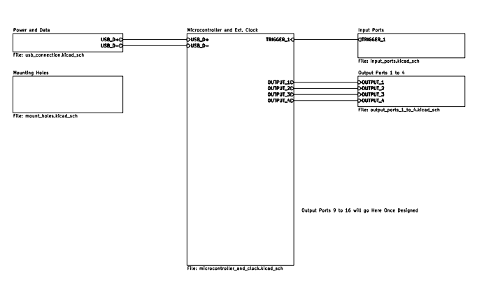
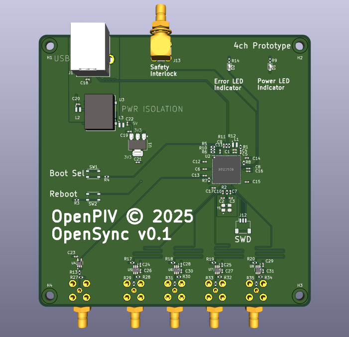

# Design and Implementation for the OpenSync Electronics

## Version History
| Date | Version | Change | 
| --- | --- | --- |
| 12/31/2025 | 0.1.0 | Intitial publishment. |

## Key Words
- IC - Internal Circuit
- PCB - Printed Circuit Board

## 1. Introduction
It is well known designing a project in steps increaseses the chances of success for that particular project. For instance, designing small prototype evaluation boards can help identify design flaws before they are pushed towards a more complete design. As such, this section focuses on prototyping in order to minimize costs associated with redesigns and repeated inquiries from PCB assemblers.

## 2. Prototype Designs

## 2.1 4 Channel Prototype
In order to assess the current design of the OpenSync synchronizer PCB, a small four channel arbitrary pulse generator has been designed. The PCB design was made to achieve three basic things: the PCB is able to be fabricated, the firmware works as intended, and to help fascilitate quantitave measurements of the design. The design software used for prototyping was KiCAD 9.0 and the PCB assembly service used is JLCPCB. While this prototype design contains one input channel and four output channels, it original contained eight output channels. This decision to reduce output channels mainly stems from the size of the PCB and the costs to fabricate it. the eight channel PCB prototype measures 155 mm x 100 compared to 100 mm x 100 mm for the four channel design. As such, the four channel design was found to be considerably cheaper to fabricate which aids in future redesigns. The high level schematic and PCB design can be seen in Figure 1 and Figure 2.

Figure 1. Highest Level PCB Schematic

Figure 2. PCB Design Layout

Since the four channel prototype contains all of the components that future eight channel prototypes and the full 16 channel synchronizer would have, quantitative testing can also be performed on this prototype in order to assess possible shortcomings of the current implementation philosophy. For instance, a 200 MHz osciliscope sampling at 2 GSa/s in single channel mode or 1 GSa/s in 2+ channel mode can be used to analyze jitter and scew down to sub 100 picosecond levels through the use of accurate interpolations and a large sample size. This is important since jitter and scew directly impacts measurement reliability in laboratory settings amd could possibly even invalidate datasets if the jitter is of significant proportions to the measurement time domain. As such, obtaining a functional prototype for a reasonably low cost is of significant importance before proceeding with further prototypes.