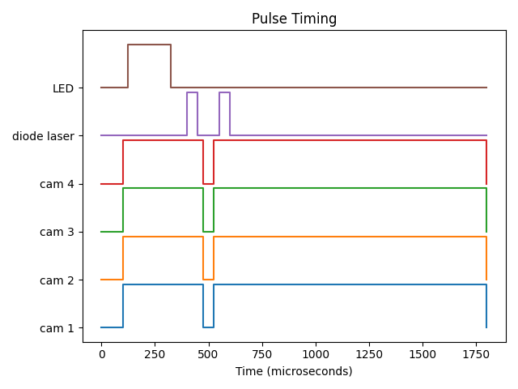

:html_theme.sidebar_secondary.remove:

OpenSync - Open source, Open hardware Synchronizer for PIV
==========================================================

OpenSync is a simple and low-cost synchronizer based on microcontroller
technology. It provides eight (8) independent output channels and two (2)
channels for accurate and precise control of laboratory equipment. With a
timing resolution of four nanosecond, it provides enough flexibility for
most users' needs when performing a PIV experiment on stringent funding.
Due to the microcontroller-based platform used in this design, OpenSync
devices remain remarkably cost effective for deterministic control of
laboratory equipment.

.. grid:: 1 1 2 2
   :gutter: 3
   :class-container: opensync-tiles

   .. grid-item-card:: 🕮 User Guide
      :link: users_guide/index
      :link-type: doc

      Learn why OpenSync exists and explore the hardware, firmware, and software.

      +++
      Read the guide ->

   .. grid-item-card:: </> API Reference
      :link: api_reference/index
      :link-type: doc

      Look up Python functions, SCPI commands, and device parameter definitions.

      +++
      Browse the reference ->

   .. grid-item-card:: [--✴] Examples (experiments)
      :link: examples/index
      :link-type: doc

      Explore the future collection of real experiments using OpenSync.

      +++
      View the experiment gallery ->

   .. grid-item-card:: [PDF] User Manual
      :link: user_manual/index
      :link-type: doc

      Find the future standalone PDF reference for device operation and parameters.

      +++
      View manual availability ->

The device at a glance
----------------------

.. list-table::
   :widths: 40 60
   :header-rows: 0

   * - System frequency
     - 250 MHz (4 ns timing resolution)
   * - Output channels
     - Eight independently programmable channels
   * - Input channels
     - Two: external trigger and gate
   * - I/O logic levels
     - 3.3 V or 5 V at high impedance

OpenSync is a low-cost digital delay/pulse generator with each output channel
owning its own timing sequence. The internal rate timer, external trigger, and
gate inputs support synchronization across an experiment. OpenSync focuses on
the timing needs of typical PIV measurements; it does not provide sub-cycle
timing or every feature of a commercial FPGA-based generator.

   An example of coordinated timing for a diode-laser experiment.

Acknowledgments
---------------

OpenSync thanks Dr. Ivan Nepomnyashchikh and Professor Alex Liberzon for
spearheading open source, open hardware equipment for the OpenPIV project.
The `original OpenPIV discussion
<https://groups.google.com/g/openpiv-users/c/xi7qt28IGEE>`_ helped initiate this
project. Cost effective commercial PIV systems from `Optolution 
<https://optolution.com/en/>`_ provided a strong inspiration to complete this
project. Additionally, certain hardware from `MicroVec Pte Ltd <https://piv.com.sg/>`_
was used as inspiration in earlier prototypes.

.. toctree::
   :hidden:
   :maxdepth: 2

   User Guide <users_guide/index>
   API Reference <api_reference/index>
   Examples (experiments) <examples/index>
   User Manual <user_manual/index>
