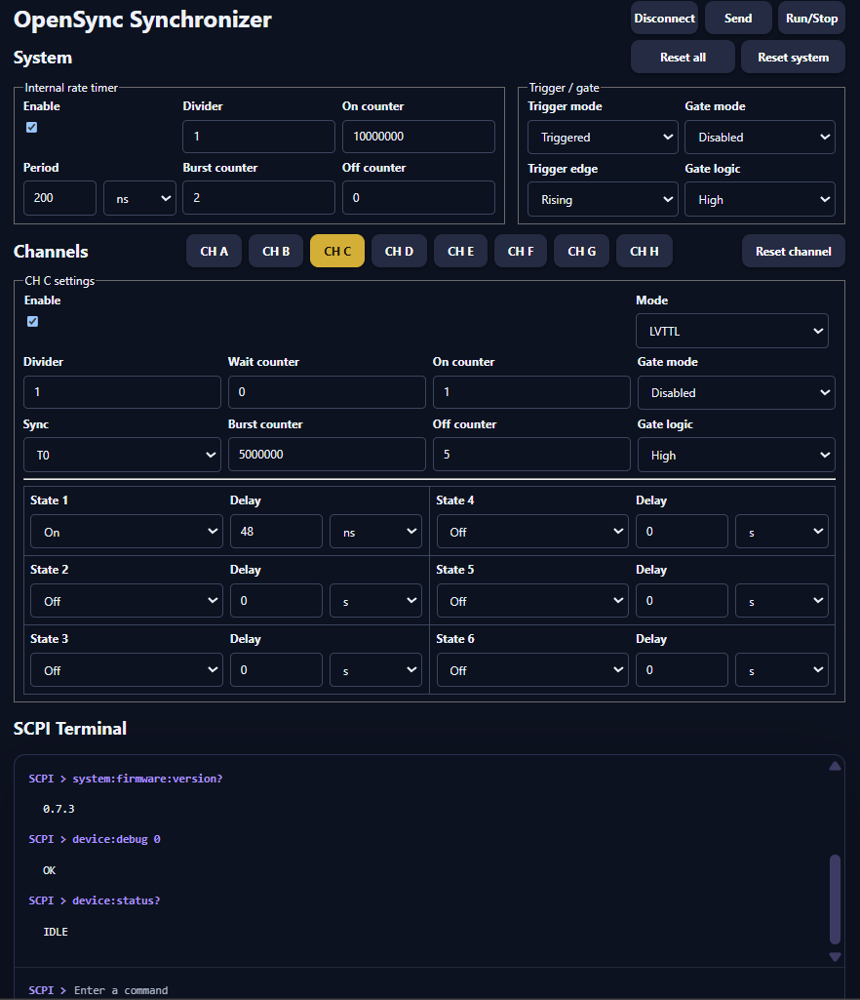

Software Guide
==============

OpenSync can be controlled from Python or from its browser-based progressive
web application (PWA). Both use the device's USB serial SCPI interface. The
Python library suits scripts, notebooks, and integration with an experiment;
the PWA provides a graphical editor and an interactive SCPI terminal.

Python package
--------------

Installation
~~~~~~~~~~~~

The planned package installation command is:

.. code-block:: console

   pip install opensync

.. note::

   Package publication is planned. Use the development setup below until
   a release is available.

For current development, use an environment where this project's OpenSync
library is already installed, or make the repository's ``software`` directory
available on Python's import path. For example, from the repository root in
PowerShell:

.. code-block:: powershell

   $env:PYTHONPATH = (Resolve-Path software).Path

The library uses NumPy, Matplotlib, and pyserial. Activate the same Python
environment for your scripts and notebooks.

Connect and read device information
~~~~~~~~~~~~~~~~~~~~~~~~~~~~~~~~~~~

Connect OpenSync over USB, discover the available devices, and read the
identity and status of the first one:

.. code-block:: python

   import opensync

   ports = opensync.device_comm_search()
   if not ports:
       raise RuntimeError("No OpenSync device found. Check the USB connection.")

   with opensync.device_comm_managed(ports[0]) as device:
       print(opensync.device_system_version(device))
       print(opensync.device_system_status(device))

The context manager closes the connection when the block ends. This example
reads device information without starting a timing sequence.

Configure and run a sequence
~~~~~~~~~~~~~~~~~~~~~~~~~~~~

The normal Python workflow is:

1. Create clock and channel parameter dictionaries with ``get_clock_params()``
   and ``get_pulse_params()``.
2. Set timing, counters, synchronization, and enabled channels using the
   ``config_clock_*`` and ``config_pulse_*`` helper functions.
3. Inspect pulse timing with ``get_pulse_plot()`` when useful.
4. Open the serial connection and upload both configurations with
   ``device_params_load(device, clock_params, pulse_params)``.
5. Use ``device_system_fire()`` to start and ``device_system_stop()`` to stop.

The notebooks below work through the individual concepts. Function details
are in the :doc:`Python API Reference <../api_reference/index>`.

PWA
---

The OpenSync Synchronizer PWA is in ``software/pwa`` and uses the Arcane OS
SDK. Its interface groups the internal rate timer and trigger/gate controls
under **System**, with settings for outputs **CH A** through **CH H** below.

   OpenSync Synchronizer PWA: system settings, output-channel controls,
   and the SCPI terminal.

Run the PWA from the checkout
~~~~~~~~~~~~~~~~~~~~~~~~~~~~~

Use the Node.js version required by ``software/pwa/package.json`` (currently
``>=22.23.2``). From the repository root:

.. code-block:: console

   cd software/pwa
   npm ci
   npm run dev -- --app opensync-pwa --http --port 8000

Open the local URL printed by the server. Device access requires a browser
with Web Serial support, such as a supported desktop Chrome or Edge version.
Web Serial is available in secure contexts: use HTTPS when hosting the app;
loopback addresses such as ``http://127.0.0.1`` are suitable for local work.
See the `Web Serial documentation
<https://developer.chrome.com/docs/capabilities/serial>`_ for browser requirements.

Use the controls
~~~~~~~~~~~~~~~~

* **Connect / Disconnect** opens or closes the USB serial connection. Select
  OpenSync in the browser's serial-port chooser when prompted.
* **System** sets the internal rate timer, its counters, and trigger/gate modes.
* **CH A--CH H** selects the output channel whose settings you are editing.
* **Send** uploads the system and channel settings to the device.
* **Run/Stop** queries device status and requests a start or stop.
* **Reset all**, **Reset system**, and **Reset channel** restore the respective
  settings in the editor. Use **Send** to apply edited settings to the device.
* **SCPI Terminal** sends individual commands and displays responses.

Settings are stored locally in the browser through DBOPFS. Editing or saving
browser settings is separate from sending them to the device. Close the serial
connection before switching control between the PWA and a Python session.

Browser distribution
~~~~~~~~~~~~~~~~~~~~

To produce the browser package from ``software/pwa``:

.. code-block:: console

   npm run package -- --app opensync-pwa

The packaged application is written to ``dist/opensync-pwa``. Serve that
folder through an appropriate web host. On a supported browser, the PWA can
be installed as an application window using the browser's installation UI.

Basic-operation notebooks
-------------------------

These notebooks teach device communication, clock configuration, and pulse
timing. They belong to this guide. Documented uses in real experiments will
appear separately under :doc:`Examples (experiments) <../examples/index>`.

.. toctree::
   :maxdepth: 1

   ../notebooks/device_communication_basics
   ../notebooks/clock_setup
   ../notebooks/pulse_timing
   ../notebooks/scpi_pulse_basics

The documentation displays the notebooks and their saved outputs without
executing their cells or opening a hardware connection.
